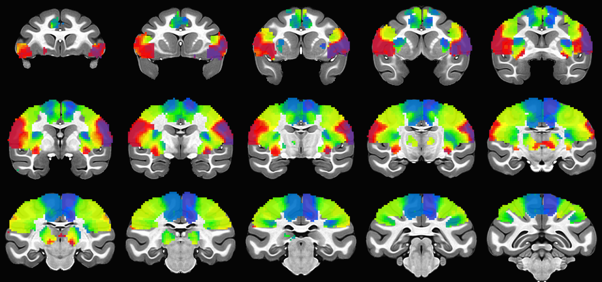
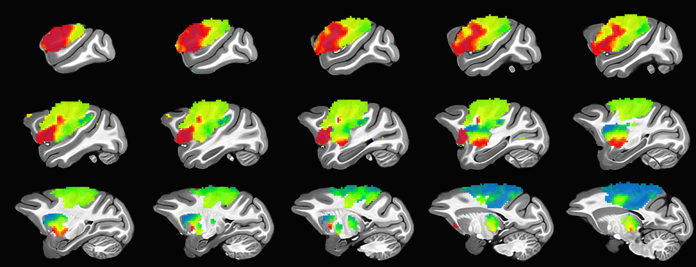
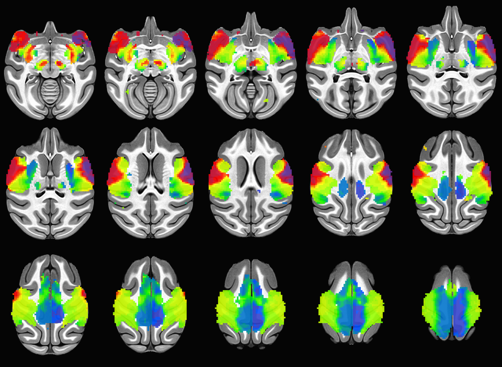

# Group Average Body Maps

This repository contains group average body maps identified from Arcaro et al. 2019, PNAS ([PubMed](https://pubmed.ncbi.nlm.nih.gov/31732670/)). The data are provided in symmetric NMT v2.0 space as well as NMT v1.3 ([AFNI NMT Templates](https://afni.nimh.nih.gov/pub/dist/doc/htmldoc/nonhuman/macaque_tempatl/template_nmtv2.html)).

## Data Description

The data are 4D (x, y, z, functional maps) and include the following sub-briks:
1. **Group average body maps**
2. **Group average statistic**

### Body Maps derived from PCA

- Values range between 0 and 100.
- 0 equals the PCA most associated with the foot representation.
- 50 equals the PCA most associated with the hand representation.
- 100 equals the PCA most associated with the face representation.

## Examples of the Maps on NMT

### Coronal View

### Sagittal View

### Axial View

## References
- Arcaro MJ, Schade PF, Livingstone MS (2019). Body-map proto-organization in newborn macaques. PNAS. [PubMed](https://pubmed.ncbi.nlm.nih.gov/31732670/).
- AFNI NMT Templates: [NMT v2.0](https://afni.nimh.nih.gov/pub/dist/doc/htmldoc/nonhuman/macaque_tempatl/template_nmtv2.html), [NMT v1.3](https://afni.nimh.nih.gov/pub/dist/doc/htmldoc/nonhuman/macaque_tempatl/template_nmtv1.html).
