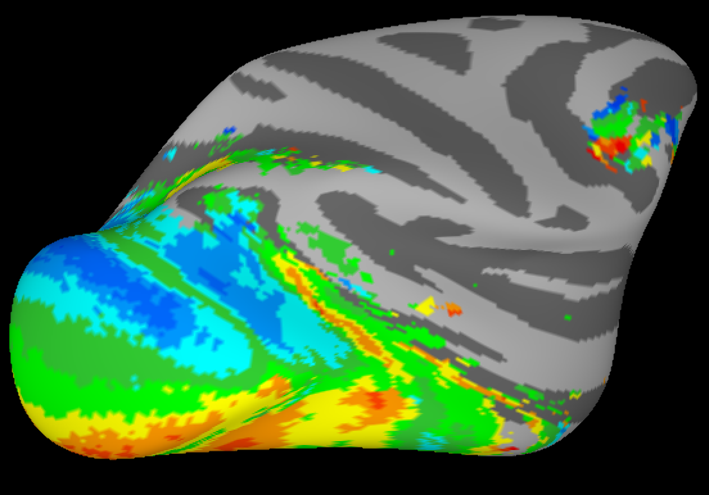

# Group Average Retinotopic Maps

This repository contains group average retinotopic maps identified from Arcaro et al. 2017, Journal of Neuroscience ([PubMed](https://pubmed.ncbi.nlm.nih.gov/28674177/)). The data are provided in both symmetric and asymmetric NMT v2.0 space as well as NMT v1.3 ([AFNI NMT Templates](https://afni.nimh.nih.gov/pub/dist/doc/htmldoc/nonhuman/macaque_tempatl/template_nmtv2.html)).

## Data Description

The data are 4D (x, y, z, functional maps) and include the following sub-briks:
1. **Group average polar angle maps**
2. **Group average F-stat for polar angle maps**
3. **Group average eccentricity maps**
4. **Group average F-stat for eccentricity maps**

### Polar Angle Maps

- Values range between -π to π.
- 0 equals the horizontal meridian in the right visual field.
- π/2 equals the lower vertical meridian.
- -π (and π) equals the horizontal meridian in the left visual field.
- -π/2 equals the upper vertical meridian.

### Eccentricity Maps

- Values range between 0 and 10.
- Reflect the distance from fixation.

## Examples of the Maps on NMT

### Coronal View

### Sagittal View

### Axial View

### Folded NMT Cortical Surface

### Inflated NMT Cortical Surface

## References
- Arcaro MJ, Pinsk MA, Li X, Kastner S. (2017). The Anatomical and Functional Organization of the Human Visual Pulvinar. Journal of Neuroscience. 37(33): 7863-7874. [PubMed](https://pubmed.ncbi.nlm.nih.gov/28674177/).
- AFNI NMT Templates: [NMT v2.0](https://afni.nimh.nih.gov/pub/dist/doc/htmldoc/nonhuman/macaque_tempatl/template_nmtv2.html), [NMT v1.3](https://afni.nimh.nih.gov/pub/dist/doc/htmldoc/nonhuman/macaque_tempatl/template_nmtv2.html).
